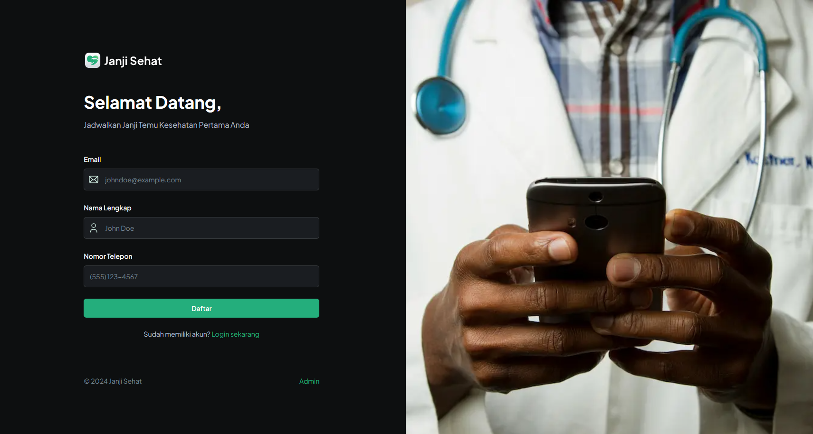

<div align="center">
  
</div>


<br />
<div align="center">
  <a href="https://makans.web.app/">
    
  </a>
</div>

## About
Janji Sehat is a web-based application designed to simplify the appointment scheduling process between patients and doctors. This platform enables users to easily create accounts, maintain personal health records, and schedule appointments with their preferred doctors. Additionally, administrators have the capability to manage, approve, or cancel appointments, ensuring a seamless experience for both patients and healthcare providers.

The primary goal of Janji Sehat is to modernize healthcare services, streamline appointment management, and improve communication between patients and medical staff.

## Built With
* 
* 
* 
* 
* 
* 
* 

### Features
- **User Account Creation**: Patients can create accounts and log in using a secure passcode sent via email.
- **Health Records**: Users can maintain their health records within their profiles.
- **Appointment Scheduling**: Easily book appointments with preferred doctors based on availability.
- **Admin Access**: Admins can approve or cancel appointments as needed.
- **Secure Login**: Login is enabled via a passcode sent to the user's registered email.

## Live Demo
https://janji-sehat.vercel.app

## User Guide

### Admin Guide

As an Admin, you have the ability to manage user appointments and access certain system features. Here’s how to use the admin features:

1. **Login as Admin**
   - **Navigate to the Homepage**: Go to the homepage of the application.
   - **Click on the 'Admin' Button**: On the homepage, click the **'Admin'** button to go to the admin login page.
   - **Enter the Admin Passcode**: Enter the passcode **`123321`** to access the admin panel.
   
2. **Admin Dashboard**
   - Once logged in, you will be redirected to the **Admin Dashboard** where you can:
     - **View Appointments**: See a list of all appointments made by users.
     - **Approve/Reject Appointments**: You can choose to accept or cancel appointments.

3. **Appointment Management**
   - **Approve/Reject Appointments**: As an admin, you will have the ability to approve or reject user appointments.
     - **Approve**: Click on an appointment to confirm it.
     - **Reject**: If necessary, click on the "Reject" button to cancel an appointment.
   - **Notification**: Users will receive an email notification about the status of their appointment (approved or canceled).

---

### User Guide

As a User (patient), you can register an account, schedule appointments with doctors, and receive notifications about your appointment status. Here's how to use the system:

#### 1. **Create an Account**
   - **Sign Up**: Go to the sign-up page.
   - **Provide Your Details**: Enter your full name, email address, phone number, and password to create your account.
   - **Submit**: Click the **Submit** button to create your account.

   After completing the sign-up process, you will be redirected to the profile page where you can add health details.

#### 2. **Create Your Profile**
   - **Complete Your Health History**: After creating your account, navigate to the **Create Profile** page.
   - **Provide Health Information**: Fill in your health history and any relevant medical notes that might help the doctor understand your health background.
   - **Save Profile**: Once your profile is complete, click **Save** to submit your profile information.

   After completing the profile, you will be redirected to the appointment page to make new appointment.

#### 3. **Schedule an Appointment**
   - **Choose a Doctor**: Once your profile is approved, go to the appointment page.
   - **Select a Date and Time**: Pick the doctor you wish to see, and choose a suitable time slot for your appointment.
   - **Submit**: Confirm your appointment by clicking the **Submit** button.

#### 4. **Receive Appointment Notifications**
   - **Email Confirmation**: After scheduling an appointment, you will receive an email confirming the appointment if it is approved by the admin.
   - **Appointment Cancellation**: If the admin rejects your appointment, you will receive an email informing you of the cancellation.

## Installation
To set up this project locally, follow these steps:

1. **Clone the Repository**  
   ```bash
   git clone https://github.com/yossyadirta/janji-sehat.git
   cd janji-sehat

2. **Install Dependencies**  
   To install the required dependencies, run one of the following commands in your terminal:

   - With npm:
     ```bash
     npm install
     ```

   - Or with yarn:
     ```bash
     yarn install
     ```
     
2. **Set Environtment Variables**  
Create a .env.local file and include the following:

    ```bash
    NEXT_PUBLIC_API_URL=your_api_url
    NEXT_PUBLIC_SENDGRID_API_KEY=your_sendgrid_api_key
    NEXT_PUBLIC_APPWRITE_PROJECT_ID=your_appwrite_project_id
    NEXT_PUBLIC_APPWRITE_ENDPOINT=your_appwrite_endpoint
    NEXT_PUBLIC_ADMIN_PASSCODE=123321
    
    NEXT_PUBLIC_PROJECT_ID=your_public_project_id
    NEXT_PUBLIC_API_KEY=your_api_url
    DATABASE_ID=your_database_id
    PATIENT_COLLECTION_ID=your_patient_collection_id
    DOCTOR_COLLECTION_ID=your_doctor_collection_id
    APPOINTMENT_COLLECTION_ID=your_appointment_collection_id
    AUTH_SESSION_COLLECTION_ID=your_auth_session_id
    NEXT_PUBLIC_BUCKET_ID=your_bucket_id
    NEXT_PUBLIC_ENDPOINT=your_appweire_endpoint
    NEXT_PUBLIC_ADMIN_PASSKEY=your-admin_passkey
    ```

4. **Start the Development Server**  
    - With npm:
    ```bash
    npm run dev
    ```
  
    - Or with yarn:
    ```bash
    yarn dev
    ```

The application will be available at http://localhost:3000
